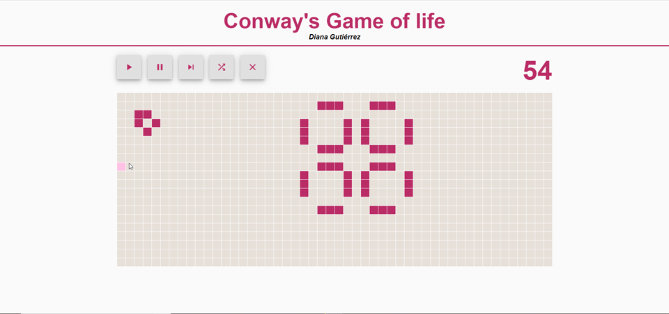

# Conway's Game of Life

This Conway's [Game of Life](https://en.wikipedia.org/wiki/Conway%27s_Game_of_Life) implementation was developed with React. The code contains no loops and no switch or if-statements.

## Demo

Live demo: https://guzd.github.io/gameOfLife/


### AVAILABLE FEATURES

This implementation of the Game of Life uses a 20x50 grid and includes the following interactive features:

- Start and Pause buttons to manipulate the simulation
- Step button to step forward just one generation
- Random start button to re-populate the grid with random values and restart the Generation count, and
- Clean button that removes all live cells.

These features are illustrated in the following GIF.


Additionally, the user can toggle the state of any of the cells by clicking on them. Using this feature, the user can draw and test any pattern.



## Installation

### Prerequisites

Install [Node.js](https://nodejs.org/es/download/)

### Step 1

Clone this repository.

```
git clone https://github.com/Guzd/gameOfLife.git
```

### Step 2

Install it.

```
yarn install
```

### Step 3

Run the app.

```
yarn start
```

### Step 4

Then you can go to http://localhost:3000 in your browser.
Enjoy!

**_Important note:_** this app is not optimized for mobile display yet.
